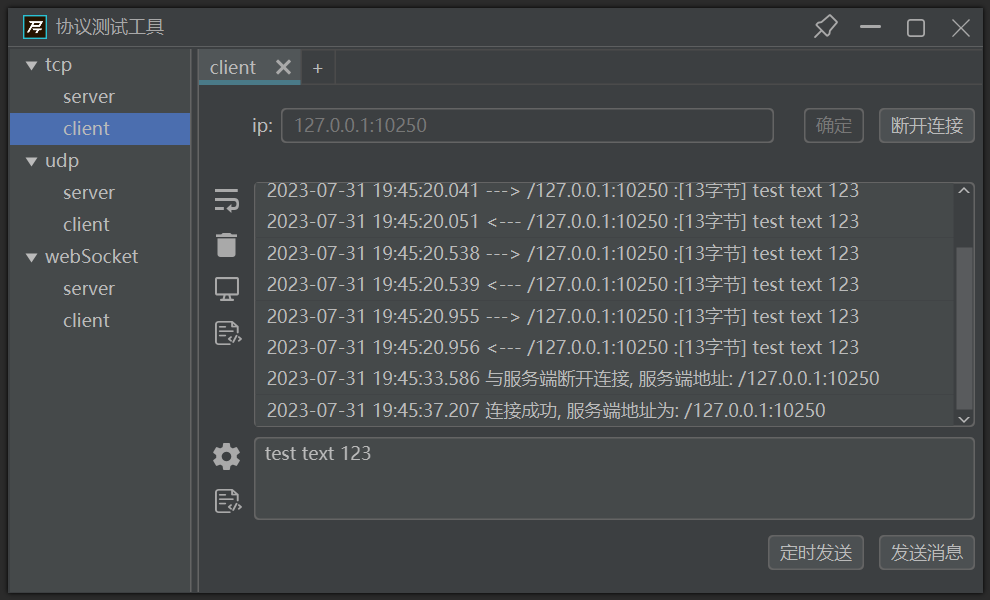

protocol test
===
English | [简体中文](./README-zh.md)
## Introduction
Simple, easy to use, fast multi network protocol Integration testing tool.
This software provides server and client support for each protocol. Intended to provide fast data transmission verification for system developers in the IoT.
For the hardware developer, the server function can be started to verify the data sent by the hardware;
For software developers, they can activate the client function to simulate the sending of hardware data for rapid development and problem localization.
Currently, supports protocol testing for udp, tcp, and websocket.
## Preview
* server preview


* client preview


## Project Architecture
* Using Netty to develop server and client
* Using JavaFX to Write GUI
## Feature
 
* Support for timed and frequency based data transmission.
* Support custom formats and generate random data using JavaScript.
* Support JSON, HEX, Base64 encoding and decoding conversion sending and display.
* Support for saving historical records.
 
## Install
This project is written based on jdk15. To run this project, please install jdk15 first.
[download openjdk15](https://jdk.java.net/java-se-ri/15)
> The project is still under development, so we will temporarily adopt the method of installing JDK. After the official version of the project is released,
> The corresponding jre will be packaged together, and there will be no need to manually install jdk during the mediation process.

### Download
Download the compressed package in the release and unzip it.
After decompression, you will see **run. bat, protocol_Test[version number].jar** two files and a **lib** folder.
### Run
#### windows
click run.bat to run application.
#### mac and linux
Due to the non-cross-platform nature of Javafx, it is necessary to clone the source code and compile it into a jar package under Mac and Linux. Execute the following command to start
```
javaw -jar filename.jar
```
filename is the name of the corresponding jar package.

example:
```
javaw -jar protocol_test-0.2.0-beta.jar
```
> **attention** <br>
>Please do not place jar packages and lib in different directories.
## Usage
### Connection
#### Server
After entering the local port, start the service on the corresponding port.
#### Client
Enter the IP address of the host you want to connect to and click Connect.
> **Attention** <br>
>No need to enter the name of the protocol< Br>
>For example, the host address you want to connect to is: tcp://127.0.0.1:10250 <br>
>Just enter: 127.0.0.1:10250.
### Data Sending
#### Fixed Text
Enter the data to be sent in the input box, and click Send to send the data.
Clicking on timed sending will default to sending data once every 1 second, and clicking again will stop sending.
#### Random Text
Click the settings button on the left side of the input box to enter the sending settings page for settings.
#### Send Settings Page
You can set the data sending method, sending interval, sending frequency, and sending text type here.
By using placeholders **%d**, **%f** can insert random integer and floating-point data at the desired location.
>Floating point data can specify the number of decimal places. For example, '%. 2f' indicates retaining 2 decimal places.
After entering custom formatted text, clicking OK will pop up the numerical range setting panel, where you can set the range of random data.

#### Message Page
A message consists of four parts: sending time, sending and receiving host, message length, and message content.
* You can click the display settings button in the sidebar to customize the display of the four parts;
* For long messages, you can click the soft return button in the sidebar to set whether to wrap;
* If the historical message is no longer in use, you can also click the trash can icon to clear the historical message.
* After selecting a message, right-click on the pop-up menu to copy the message. You can choose to copy the entire message or only the part of the message content.
 
#### Client Group
The client group section of the server page displays all clients that have established connections to the current service.
You can select multiple clients, send messages to them in bulk, and disconnect them.
>The multi selection method is to hold down the Ctrl key and select the client with the mouse.

>Due to the connectionless nature of the UDP protocol, the client group of the UDP server will be added when the data packet arrives, rather than destroyed,
If it is confirmed that the UDP client has been shut down, please manually clear it.
#### Save
When exiting the program, a save dialog box will pop up. Click OK to save the configuration (historical messages sent and received will not be saved).
The configuration will be automatically loaded the next time the program is started.
#### Workflow Preview

 https://github.com/lao-boli/protocol_test/assets/66947448/3764c423-b5b0-459c-9f5c-6798a8275bcf
 
## Future
* environment variables config
* mqtt protocol test
* wss protocol test
* custom protocol test
